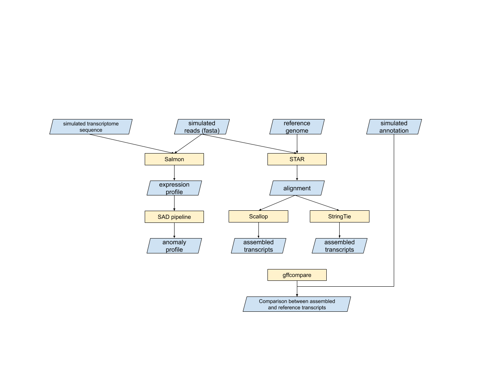
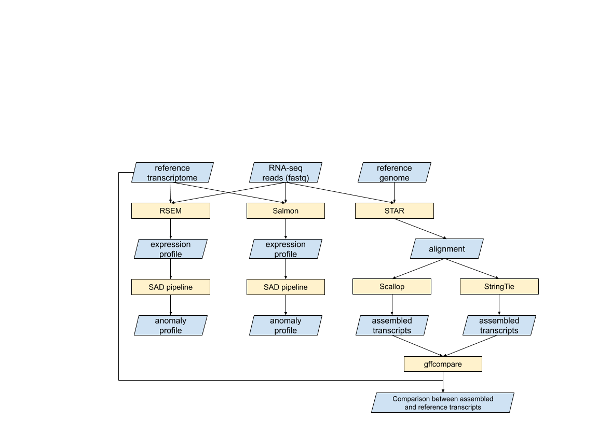
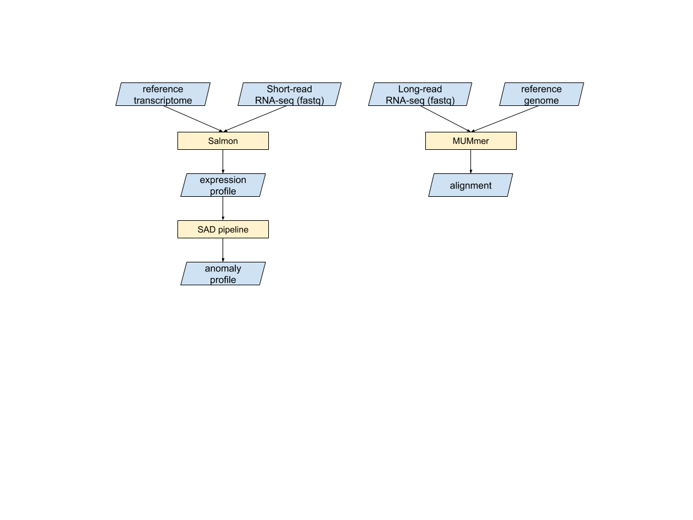

# OVERVIEW
This repository stores the data information and processing scripts that are used in Salmon Anomaly Detection (SAD) manuscript. In total, four datasets are used in six subsections in the results. The processing steps for each dataset and the analyses for each result subsection are listed below. The implementation of SAD is available at [https://github.com/Kingsford-Group/sad](https://github.com/Kingsford-Group/sad).


# Obtaining the data
The bash script `script/preparing_data.sh` downloads the needed reference and RNA-seq datasets. The download requires about 500G space. To run the bash script,
```
script/preparing_data.sh <output directory>
```
A description of the reference and the RNA-seq datasets are listed below.

## Simulated data

### Simulating specification
Both simulated reference transcriptome and simulated RNA-seq reads are generated. The simulated reference transcriptome is generated by randomly excluding an random isoform of 200, 500, 1000, 1500 genes. RNA-seq reads are simulated based on the simulated reference transcriptome by polyester. The base expression of the simulated reference transcriptome is assigned to be the expression profile of 3 real RNA-seq samples quantified by Salmon. The 3 real RNA-seq samples are: one GEU sample from GEUVADIS dataset, one GM12878 sample from ENCODE project, one K562 sample from ENCODE project.

### Required software
- Salmon [https://salmon.readthedocs.io/en/latest/](https://salmon.readthedocs.io/en/latest/)
- R
- polyester (R package) [https://github.com/alyssafrazee/polyester](https://github.com/alyssafrazee/polyester)
- python3

## GEUVADIS dataset
30 samples from GEUVADIS project is used. They are all from TSI population but sequenced from two sequencing centers. Their accession number is listed in `data/GEUVADIS/Metadata.txt`.

## Human Body Map dataset
Human Body Map dataset contains 16 samples each from a unique tissue. Their accession number is listed in `data/HumanBodyMap/HumanBodyMap_SraRunTable.txt`.

## Paired long-read and short-read RNA-seq for 9 trios in 1000 Genome project
9 trios (27 individuals) in 1000 Genome project has a paired long-read and short-read RNA-seq data. The long reads are sequenced by PacBio SMRT technology and are supposed to contain the full sequence of the expressed transcripts. The long-read accession number is listed in `data/LongRead1000G/lr_Metadata.txt`. The short-read RNA-seq accession number is listed in `data/LongRead1000G/lr_Metadata.txt`.

## Reference genome and transcriptome
Human reference genome GRCh38 with Gencode transcriptome annotation (version 26) is used. The genome fasta file can be accessed from [ftp://ftp.ebi.ac.uk/pub/databases/gencode/Gencode_human/release_26/GRCh38.primary_assembly.genome.fa.gz](ftp://ftp.ebi.ac.uk/pub/databases/gencode/Gencode_human/release_26/GRCh38.primary_assembly.genome.fa.gz). Full transcriptome fasta file can be accessed from [ftp://ftp.ebi.ac.uk/pub/databases/gencode/Gencode_human/release_26/gencode.v26.transcripts.fa.gz](ftp://ftp.ebi.ac.uk/pub/databases/gencode/Gencode_human/release_26/gencode.v26.transcripts.fa.gz). Protein-coding-only transcriptome fasta file can be accessed from [ftp://ftp.ebi.ac.uk/pub/databases/gencode/Gencode_human/release_26/gencode.v26.pc_transcripts.fa.gz](ftp://ftp.ebi.ac.uk/pub/databases/gencode/Gencode_human/release_26/gencode.v26.pc_transcripts.fa.gz). Annotation GTF file can be accessed from [ftp://ftp.ebi.ac.uk/pub/databases/gencode/Gencode_human/release_26/gencode.v26.annotation.gtf.gz](ftp://ftp.ebi.ac.uk/pub/databases/gencode/Gencode_human/release_26/gencode.v26.annotation.gtf.gz). STAR, RSEM and Salmon Index are also generated when obtaining the reference.

### Required software
- Salmon [https://salmon.readthedocs.io/en/latest/](https://salmon.readthedocs.io/en/latest/)
- STAR [https://github.com/alexdobin/STAR](https://github.com/alexdobin/STAR)
- RSEM [https://deweylab.github.io/RSEM/](https://deweylab.github.io/RSEM/)
- eXpress [https://pachterlab.github.io/eXpress/index.html](https://pachterlab.github.io/eXpress/index.html)


# Processing the data

## Simulated data

### Workflow


### Required Software
- STAR [https://github.com/alexdobin/STAR](https://github.com/alexdobin/STAR)
- StringTie [https://ccb.jhu.edu/software/stringtie/](https://ccb.jhu.edu/software/stringtie/)
- Scallop [https://github.com/Kingsford-Group/scallop](https://github.com/Kingsford-Group/scallop)
- Gffcompare [https://ccb.jhu.edu/software/stringtie/gffcompare.shtml](https://ccb.jhu.edu/software/stringtie/gffcompare.shtml)
- Salmon [https://salmon.readthedocs.io/en/latest/](https://salmon.readthedocs.io/en/latest/)
- samtools [http://www.htslib.org/](http://www.htslib.org/)
- python3

### Processing code
The bash script `script/RunSimulation.sh` runs the processing steps in the workflow. To run this script:
```
RunSimulation.sh <sad code directory> <prepare data output directory>
```

## GEUVADIS and Human Body Map datasets

### Workflow


### Required Software
The same as the ones used in Simulated data.

### Processing code
The bash script `script/RunRealGEUDAVIS.sh` and `script/RunRealHumanBodyMap.sh` run the processing steps in the workflow for GEUVADIS and Human Body Map data separately. To both scripts
```
RunRealGEUDAVIS.sh <sad code directory> <prepare data output directory>
RunRealHumanBodyMap.sh <sad code directory> <prepare data output directory>
```

## Paired long-read and short-read RNA-seq for 9 trios in 1000 Genome project

### Workflow


### Required Software
- Salmon [https://salmon.readthedocs.io/en/latest/](https://salmon.readthedocs.io/en/latest/)
- samtools [http://www.htslib.org/](http://www.htslib.org/)
- MUMmer [https://github.com/mummer4/mummer](https://github.com/mummer4/mummer)
- python3
- tqdm (python3 package) [https://github.com/tqdm/tqdm](https://github.com/tqdm/tqdm)

### Processing code
The bash script `script/RunLongread.sh` runs the processing steps of both long-read and short-read indicated in the workflow. To run the script:
```
RunLongread.sh <sad directory> <prepare data output directory>
```


# Analyzing and plotting

### Requred software
- python3
- numpy (python3 package) [https://numpy.org/](https://numpy.org/)
- pandas (python3 package) [https://pandas.pydata.org/](https://pandas.pydata.org/)
- matplotlib (python3 package) [https://matplotlib.org/](https://matplotlib.org/)
- R
- ggplot2 (R package) [https://cran.r-project.org/web/packages/ggplot2/index.html](https://cran.r-project.org/web/packages/ggplot2/index.html)
- cowplot (R package) [https://cran.r-project.org/web/packages/cowplot/index.html](https://cran.r-project.org/web/packages/cowplot/index.html)
- DESeq2 (R package) [https://bioconductor.org/packages/release/bioc/html/DESeq2.html](https://bioconductor.org/packages/release/bioc/html/DESeq2.html)
- readr (R package) [https://cran.r-project.org/web/packages/readr/index.html](https://cran.r-project.org/web/packages/readr/index.html)
- tximport (R package) [https://bioconductor.org/packages/release/bioc/html/tximport.html](https://bioconductor.org/packages/release/bioc/html/tximport.html)
- assertthat (R package) [https://cran.r-project.org/web/packages/assertthat/index.html](https://cran.r-project.org/web/packages/assertthat/index.html)

### ploting the example coverage distributions
To plot the example distributions in Figure 1, Figure 2 A-B, Supplementary Figure S12---S15, use python script `script/plot_examples.py`.
```
python3 plot_examples.py <prepare data directory> <figure output directory>
```

### plotting patterns of unadjustable anomalies
To plot the patterns of the over-(under-) expressed region of common unadjustable anomalies, use `script/AnalyzeRealData_sharedtrans.py` to collect the common ones.
```
python3 AnalyzeRealData_sharedtrans.py <prepare data directory> <output directory>
```
And then, `script/plot_common_unadjustable.R` generates the plot in Figure 2 C---D and Supplementary Figure S9.
```
Rscript plot_common_unadjustable.R <output directory of AnalyzeRealData_sharedtrans.py> <output figure directory>
```

### plot the overlap between Salmon anomalies and assembled transcripts, identifiability and RSEM anomalies
The following script plots the overlap between SAD anomalies and assembled transcripts, RSEM anomalies, and eXpress identifiability, corresponding to Supplementary Figure S8, S10---S11.
```
Rscript plot_anomaly_overlap.R <prepare data directory> <output figure directory>
```

### count the number of DE transcripts and plot the expression
The following script count the number of detected DE transcript under Salmon and under SAD-adjusted quantification on GEUVADIS samples. The outputs are: the count table in Table 1 and Supplementary Figure S6---S7.
```
Rscript plot_DE.R <prepare data directory> <output figure directory>
```

### plot the comparison result of simulated data
The following scripts plot the result of simulated data. Specifically, they generates Supplementary Figure S16, the comparison of predicting unannotated transcripts using unadjustable anomaly and transcriptome assemblers, the sensitivity of unannotated transcript prediction, and the comparison of quantification accuracy using SAD-adjusted and Salmon quantification of the adjustable anomalies.
```
python3 SADAnalysis_simusensitivity.py <prepare data directory>
Rscript plot_simulated.R <prepare data directory> <output figure directory>
```

### plot the overlap between unadjustable anomalies and long read transcripts
The following plot shows Supplementary Figure S17, the percentage of unadjustable anomalies that have correspondences in long read alignment.
```
Rscript plot_longread.R <prepare data directory> <output figure directory>
```
